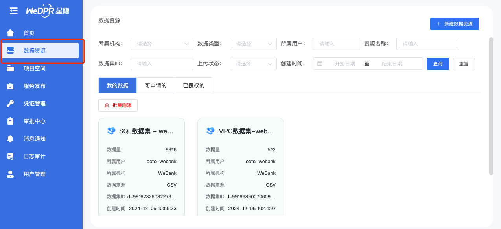
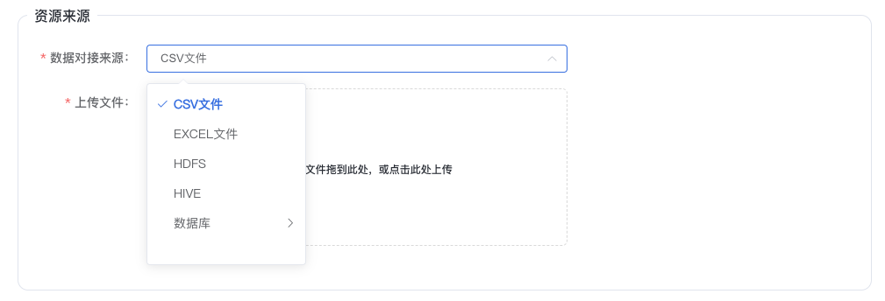
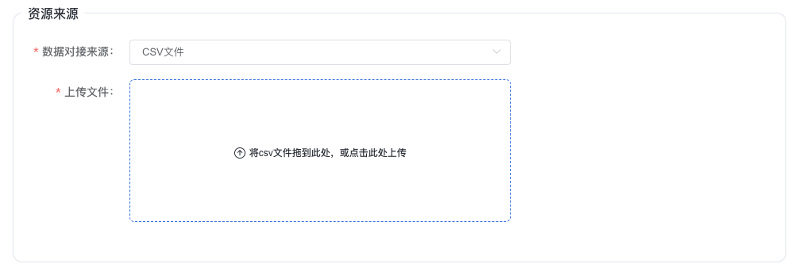
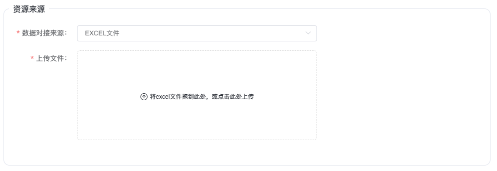
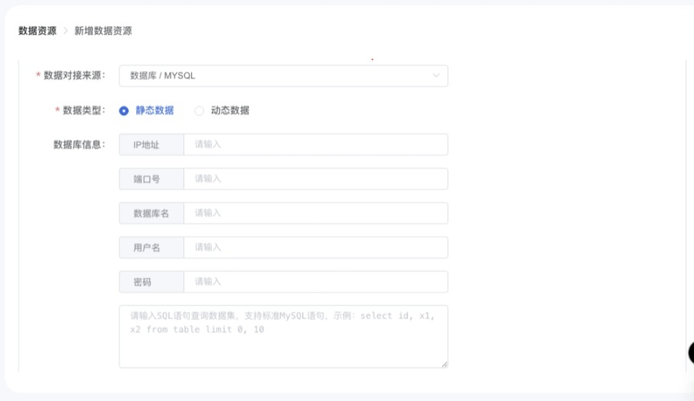
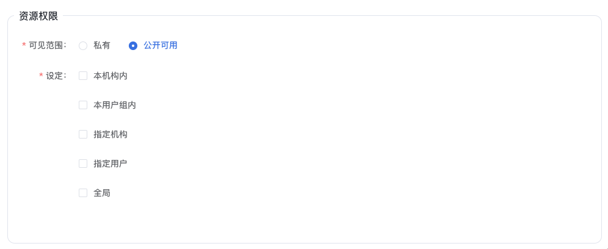
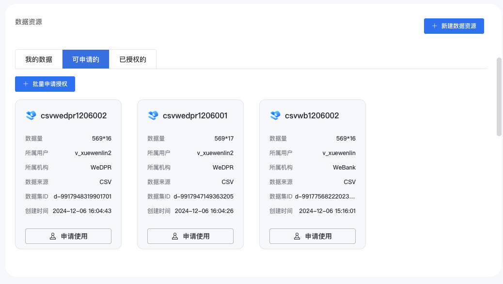
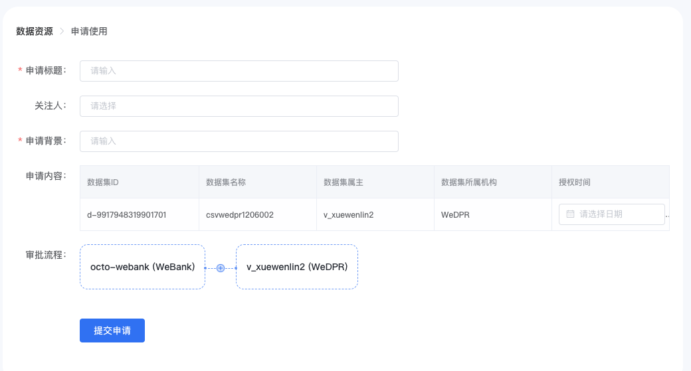

# 2. 数据集操作指引

用户可以在 **数据资源** 标签页面查看数据集，以及进行数据集的相关操作

## 2.1 数据集展示

数据集数据分为三个页面进行展示:

- 我的数据
  - 当前登录的用户上传的数据集
- 可申请的
  - 其他用户上传，当前登录用户可见且未申请授权，不可使用的数据集
- 已授权的
  - 其他用户上传，当前登录用户可见且已经申请授权，审批通过，可以使用的数据集

## 2.2 创建数据集

创建一个数据集需要填写下列信息:

- 基础信息
  - 数据集的名称、简介、标签信息

- 资源来源
  - 数据集的数据来源，支持的数据来源方式有：
    - 上传CSV文件
    - 上传EXCEL文件
    - 指定HDFS文件路径
    - 指定HIVE SQL语句
    - 指定数据库SQL语句

- 资源权限
  - 数据集的可见性设置, 支持全局、机构、用户组、用户级别的可见性

- 审批流
  - 其他申请使用数据集时的审批链接

### 2.2.1 基础信息

- 资源名称
  - 数据集的名称，必填项
- 资源简介
  - 数据集的简介信息，必填项
- 资源标签
  - 数据集标签信息，可选项

### 2.2.2 资源来源

数据集数据来源支持下面的类型:
    CSV文件、EXCEL文件、HDFS、HIVE、数据库。

- CSV文件

用户选择需要上传的csv文件。

----------------------------------------------------------------

- EXCEL文件

用户选择需要上传的excel文件。

----------------------------------------------------------------

- HDFS

用户填写HDFS上存在csv文件路径。

----------------------------------------------------------------

- HIVE

- 数据类型:
  - 静态数据
  - 动态数据

- Hive SQL:
  - 数据来源的SQL语句，**仅支持SELECT查询语句**

----------------------------------------------------------------

- 数据库
  
  支持下列类型的数据库作为数据集的数据源:
  - MYSQL
  - 达梦
  - POSTGRESQL
  - 高斯
  - 人大金仓
  - 神通

参数:

- 数据类型
  - 静态数据
  - 动态数据
  
- 数据库信息：  
  - IP地址
    - 访问数据库的IP
  - 端口号
    - 访问数据库的端口号
  - 数据库名
    - 数据库名
  - 用户名
    - 访问数据库的用户名
  - 密码
    - 访问数据库的密码
  - SQL
    - 数据来源的SQL语句，**仅支持SELECT查询语句**

### 2.2.3 资源权限

这里的数据权限指的是数据集的可见性权限。

- 可见范围: 私有
  可见性为私有的数据集仅仅对数据集的属主用户可见，其他用户均不可见该数据集。

- 可见范围: 公开可用
  公开可用的数据集根据可见范围不同，可见的用户也不相同。

  **注意**: 创建新的数据集成功后, 该数据集可见范围为公开可用时，其他用户可以在数据集页面, 标签为 **可申请的** 数据列表里面看到该数据集。

- 本机构内
  - 同一机构的用户可见
- 本用户组内
  - 本机构内的同一用户组的用户可见。
- 指定机构
  - 执行的机构的用户可见。
- 指定用户
  - 指定的用户可见
- 全局
  - 所有的用户均可见

### 2.2.4  审批流

其他用户申请使用数据集时，参与负责审批的人员名单。

默认的审批流如下：

用户可以添加审批人员：

## 2.3 申请数据集

用户可以在数据集页面, 标签为 **可申请的** 数据列表里面看到可以申请的数据集列表。

申请流程：

- 选择申请的数据集
- 点击'申请使用'
- 填写申请单
申请单格式如下:

  - 申请标题
    - 申请单的标题，用户自填
  - 关注人
    - 关注人会收到审批信息
  - 申请背景
    - 申请的用途详情
  - 申请内容
    - 申请的数据集，需要选择授权的时间，即授权的有效期
  - 审批流
    - 参与审批的人员列表，可以编辑，新增审批人员

## 2.4 使用数据集

使用数据集的过程, 请参考:

- [隐私计算任务操作指引(向导模式)](./wizard_mode_op.md)
- [隐私计算任务操作指引(专家模式)](./expert_mode_op.md)
